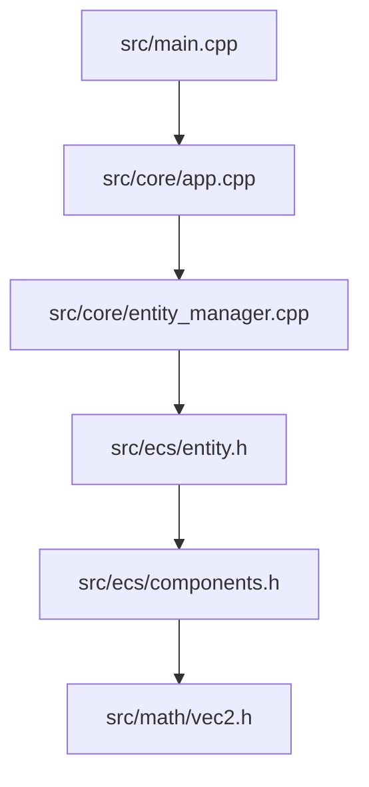

# Proje Genel Bakış: Astral Engine (SDL3)

Bu proje, C++ ve SDL3 kütüphanesi kullanılarak geliştirilmiş, Veri Odaklı Tasarım (Data-Oriented Design) ve ECS (Entity-Component-System) prensiplerini temel alan basit bir oyun motoru mimarisidir.

## Mimari Yapı

Proje üç ana katmandan oluşur:

1.  **Giriş Katmanı (`src/main.cpp`):** Programın başladığı ve `App` sınıfının hayata geçirildiği yerdir.
2.  **Motor Katmanı (`src/core/app.cpp`):** SDL sistemlerinin yönetimi, ana oyun döngüsü ve kare zamanlaması (Delta Time) burada halledilir.
3.  **Varlık Sistemi (`src/core/entity_manager.cpp`, `src/ecs/entity.h`, `src/ecs/components.h`):** Oyun dünyasındaki nesnelerin yönetildiği yerdir. ECS mimarisinin hafifletilmiş bir versiyonunu kullanır.

## Dosyalar Arası İlişki Diyagramı

## Nasıl Başlanır?

Yeni bir geliştirici olarak projeyi anlamak için şu adımları izleyin:

1.  **`src/main.cpp`**: Programın nasıl başladığını görün.
2.  **`App::init`**: Pencerenin nasıl açıldığını ve ilk "player" varlığının nasıl oluşturulduğunu inceleyin.
3.  **`App::update`**: Klavye girdilerinin nasıl okunduğunu ve `transform.pos` değerinin nasıl güncellendiğini görün.
4.  **`EntityManager::update`**: Varlıkların neden anında değil de bir sonraki karede eklendiğini (safe-delete/safe-add) anlayın.

## Temel Akış
Her karede (frame) şu işlem sırası takip edilir:
1.  **Events**: Girdi toplanır.
2.  **Update**: Mantık yürütülür, konumlar değişir.
3.  **EntityManager Update**: Ölü varlıklar temizlenir, yeniler eklenir.
4.  **Render**: Tüm aktif varlıklar `CShape` ve `CTransform` verilerine göre ekrana çizilir.
